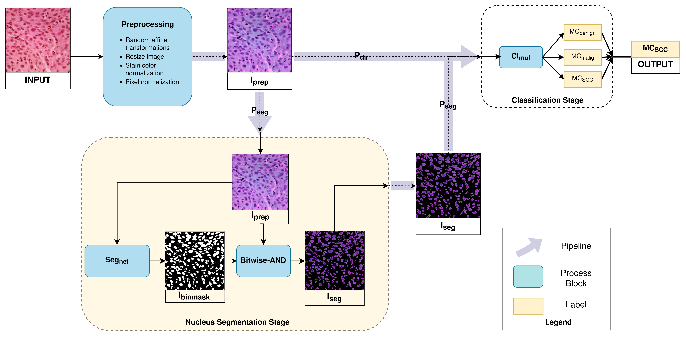

# Lung Tumor Subtyping and Nucleus Segmentation

- Deep-learning based classification pipeline for subtyping lung tumors from histology.
- Assessing the impact of nucleus segmentation on tumor discernibility.

[Link to the Research Paper [HTML]](https://link.springer.com/article/10.1007/s13721-023-00417-2).

## Cite us

If you find our work useful in your research, please cite us!

```
@article{jsm2023,
  title={A deep learning approach for nucleus segmentation and tumor classification from lung histopathological images},
  author={Jaisakthi, SM and Desingu, Karthik and Mirunalini, P and Pavya, S and Priyadharshini, N},
  journal={Network Modeling Analysis in Health Informatics and Bioinformatics},
  volume={12},
  number={1},
  pages={22},
  year={2023},
  publisher={Springer},
  url={https://link.springer.com/article/10.1007/s13721-023-00417-2},
  doi={https://doi.org/10.1007/s13721-023-00417-2}
}
```

## Study Overview



The study method is summarized as a **brief algorithm** below.    
      
  

## Study Dataset and Data Processing

The histopathology image dataset is sourced from [LC25000 Dataset](https://www.kaggle.com/datasets/andrewmvd/lung-and-colon-cancer-histopathological-images).
  - *768 x 768* resolution images of lung histology.
  - Contains patch-level labels of tumor type.
  - [HIPAA](https://www.cdc.gov/phlp/publications/topic/hipaa.html) compliant and validated source.
  - [Detailed data description](https://arxiv.org/abs/1912.12142v1).
  
### Semi-automated nuclear region annotation
1. Automated nuclear region annotation were obtained using a **stain-based color thresholding approach**, detailed in the algorithm below.   
   
2. The obtained annotations were corrected and **validated by expert pathologists**.
3. Multiple pathologist corrections were compared and averaged. The inter-rater agreement was assessed using **generalized conformity index (GCI)**; a GCI of 0.89 was obtained.

## Common Downstream Tumor Classification

- The classifier is a **custom lightweight Convolution Neural Network** that performs downstream tumor subtyping.
- The common downstream serves the role of a discriminator reference to compare subtyping performances with and without prior nucleus segmentation of histology images.
   
  

## Intermediate Nucleus Segmentation in the P<sub>seg</sub> Pipeline

- **Rationale:** The nuclei portray sufficiently distinct visual characteristics under each tumor type to discern them apart.
- Nuclear regions of the lung histology images are segmented out before classification.
- A segmentation architecture derived from the [Xception-style UNet](https://keras.io/examples/vision/oxford_pets_image_segmentation/) is trained and fine-tuned to automate this nucleus segmentation.
